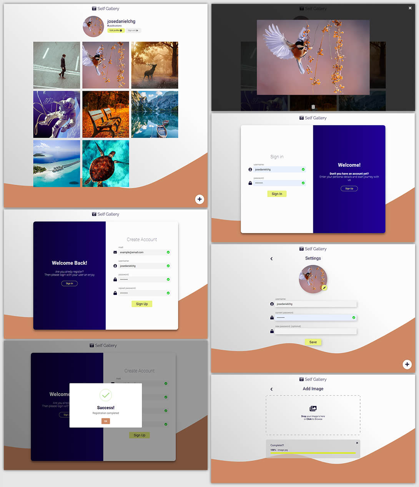

# SelfGallery with PHP, MySQL

This is an application to upload your photos on the web that uses PHP and MySQL. This app can:

- add/display/delete your images
- Allows users to do log in and upload their photos

Some functionalities of the application are:

- Model-View-Controller design pattern
- Queries with MySQL
- Authentication and user registration
- Use of sessions

# Screenshots

# How to use

1. Download the archive or clone the project using git
1. Start MySQL services
1. Go to phpMyAdmin and import the `selfgallery_schema.sql` file
1. In the `config` folder open the file `DB.php` and configure it with your user, password and table
1. Go to the `public` folder
1. Start php server by running command `php -S 127.0.0.1:8080`
1. Open in browser http://127.0.0.1:8080
